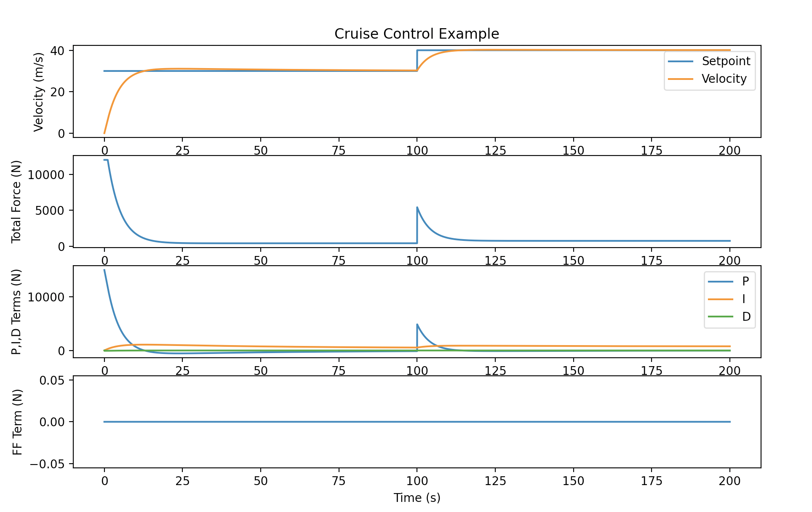

Cruise Control Example (Python & C++)
==============================================
Summary
-------
This example is constructed to demonstrate at least a basic level of coding knowledge in C++ and Python. It also demonstrates some knowledge of dynamic modelling, controls and git revision control. 

**Model**

A simple vehicle model is developed that consists of vehicle mass, air resistance, rolling friction. The vehicle equations are taken from this example: http://www.cds.caltech.edu/~murray/amwiki/Cruise_control

The set point was updated half way through the sim to show how the PID terms vary.

Model Input: Force (N)

Model Output: Vehicle velocity (m/s)

**Controller**

A PID controller with a feed-forward term is used to control the vehicle to a desired setpoint.

The feed-forward lookup table was constructed by finding the required force to maintain a desired velocity setpoint. [Ran out of time for this]

The PID gains were determined with simple hand tuning using the Ziegler-Nichols method as follows:
With the integral and derivative gain set to zero, increase the proportional gain until the system starts to oscillate at the ultimate gain (Ku) at the oscillation period (Tu).

Kp = 0.6 * Ku

Ki = 1.2 * Ku / Tu

Kd = 3.0 * Ku * Tu / Tu

[Ended up roughly hand tuning, it is a first order system.]

-----------
Build It
-----------
    git clone XXXXXXXXXXXX
    cd cruisecontrol
    mkdir build
    cd build
    cmake ..
    make && ctest

-----------
Run It
-----------

    ./targets/CruiseControl
----------------
Plot It
----------------
    python3 ../plot_cruise_control_data.py data_file.txt

Example Plot

-----------